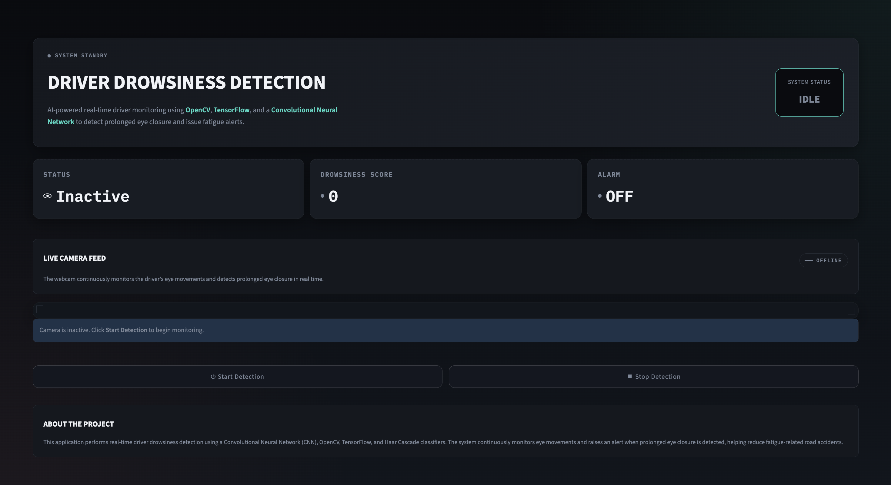

# Driver Drowsiness Detection System

A real-time driver monitoring application that detects signs of drowsiness using computer vision and deep learning. The system captures live webcam video, detects the driver's face and eyes using Haar Cascade classifiers, classifies eye states using a Convolutional Neural Network (CNN), and triggers visual and audio alerts when prolonged eye closure is detected.

This project is built using **Python, OpenCV, TensorFlow/Keras, Streamlit, and Haar Cascade Classifiers**, providing an interactive interface for real-time fatigue monitoring.

---

## Overview

Driver fatigue is one of the leading causes of road accidents worldwide. This application aims to improve road safety by continuously monitoring a driver's eye movements and identifying prolonged eye closure that may indicate drowsiness.

The system performs real-time face and eye detection, classifies eye states using a trained CNN model, and distinguishes natural blinks from genuine drowsiness using a time-based threshold before raising an alert.

---

## Features

- Real-time webcam monitoring
- Face detection using Haar Cascade classifiers
- Eye detection within the detected face region
- CNN-based eye state classification
- Visual and audio drowsiness alerts
- Live drowsiness score monitoring
- Time-based blink filtering to reduce false alarms
- Optimized real-time performance with Streamlit

---

## Technology Stack

| Category | Technologies |
|----------|--------------|
| Language | Python |
| Deep Learning | TensorFlow, Keras |
| Computer Vision | OpenCV |
| Web Framework | Streamlit |
| Audio | Pygame |
| Image Processing | NumPy |
| Face & Eye Detection | Haar Cascade Classifiers |

---

## Project Structure

```text
Driver-Drowsiness-detection/
│
├── app.py
├── detection.py
├── requirements.txt
├── alarm.wav
├── README.md
│
├── model/
│   └── CNN__model.h5
│
├── haarcascade/
│   ├── haarcascade_eye.xml
│   ├── haarcascade_frontalface_alt.xml
│   ├── haarcascade_lefteye_2splits.xml
│   └── haarcascade_righteye_2splits.xml
│
└── image/
    └── img.png
```

---

## Application Screenshot

<p align="center">
  
</p>

---

## Installation

Clone the repository:

```bash
git clone https://github.com/saopreksha19-art/Driver-Drowsiness-detection.git
```

Navigate to the project directory:

```bash
cd Driver-Drowsiness-detection
```

Create and activate a virtual environment.

### Windows

```bash
python -m venv .venv
.venv\Scripts\activate
```

### macOS / Linux

```bash
python3 -m venv .venv
source .venv/bin/activate
```

Install the required dependencies:

```bash
pip install -r requirements.txt
```

---

## Running the Application

Launch the Streamlit application:

```bash
streamlit run app.py
```

The application will open in your default browser at:

```
http://localhost:8501
```

---

## System Workflow

1. Capture live video frames from the webcam.
2. Convert each frame to grayscale.
3. Detect the driver's face using Haar Cascade classifiers.
4. Detect the left and right eyes within the detected face region.
5. Preprocess the eye images and pass them to the CNN model.
6. Classify each eye as open or closed.
7. Monitor continuous eye closure using a time-based threshold.
8. Trigger visual and audio alerts when prolonged eye closure is detected.

---

## Performance Optimizations

- Downscaled face detection for faster processing
- Face Region of Interest (ROI) based eye detection
- Time-based blink filtering to distinguish natural blinks from drowsiness
- Reduced false alarms caused by temporary detection failures
- Efficient real-time inference using TensorFlow/Keras

---

## Future Improvements

- MediaPipe Face Mesh integration
- Eye Aspect Ratio (EAR) based drowsiness detection
- Head pose estimation
- Yawning detection
- Low-light performance improvements
- Mobile and edge-device deployment
- Driver analytics dashboard

---

---

## Author

**Preksha Sao**

GitHub: https://github.com/saopreksha19-art
